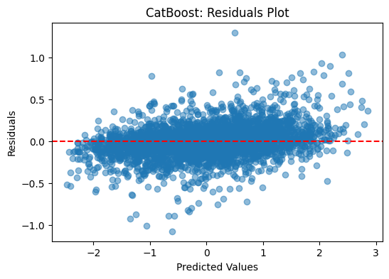

# Shell.ai 6th Edition — Fuel Blend Property Prediction
Predict the properties of fuel blends formed by mixing sustainable and conventional components. The task is a multi-target regression problem evaluated primarily with MAPE (Mean Absolute Percentage Error).

## Project Overview

Goal: Estimate 10 blend properties (`BlendProperty1..10`) from component fractions and per-component properties.

Data: CSV files in `dataset/`
- `train.csv` — training data with features and 10 target columns
- `test.csv` — test data with an `ID` column and features (no targets)
- `result/submission_catboost.csv` — example submission with predictions

Notebook: Main workflow in `BlendProperty.ipynb`

Best Model (from notebook experiments): CatBoost (R² ≈ 0.970, RMSE ≈ 0.172, MAPE ≈ 0.854)

## Repository Structure

- `dataset/` — input CSVs
- `result/plots/` — saved figures (see below)
- `result/submission_catboost.csv` — prediction file (example)
- `BlendProperty.ipynb` — data prep, modeling, prediction
- `requirements.txt` — project dependencies
- `README.md` — project documentation

## Key Results & Visualizations

Below are core plots stored in `result/plots/`.

Actual vs Predicted

Residuals Analysis

Tip: Additional evaluation (per-target metrics, residual distributions) can be generated directly in the notebook.

## Tech Stack

pandas, numpy, scikit-learn, matplotlib, catboost, xgboost, lightgbm

## Acknowledgements

This project was developed for the Shell.ai Hackathon (6th year edition).

